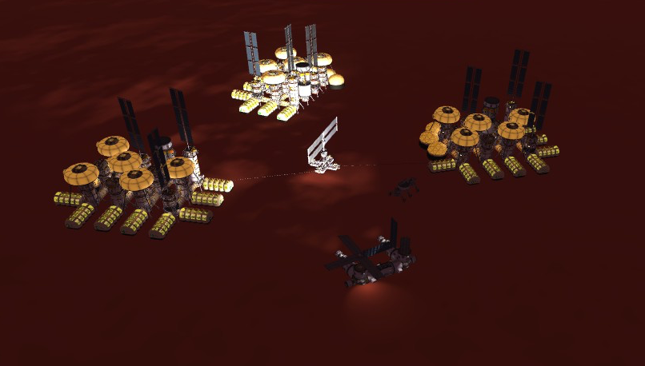
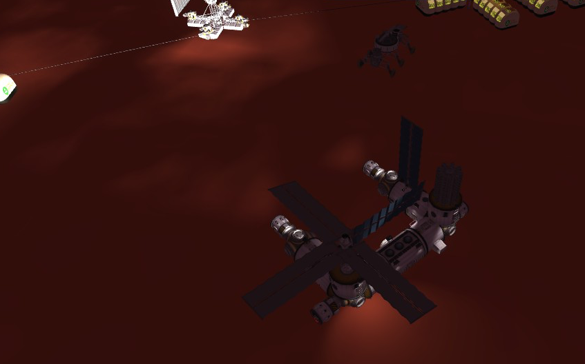
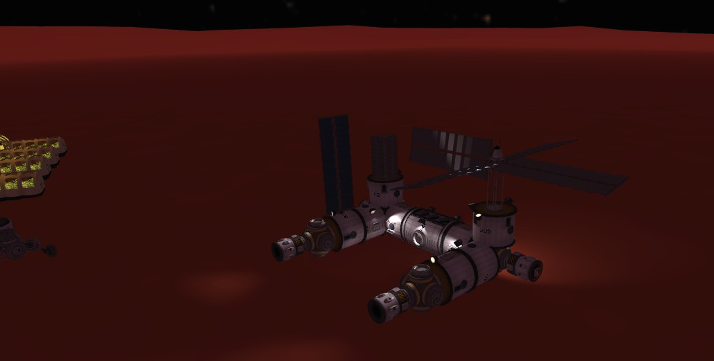
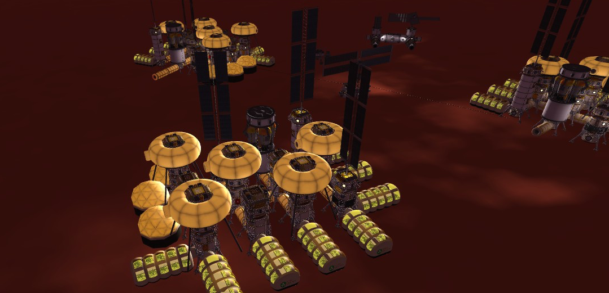
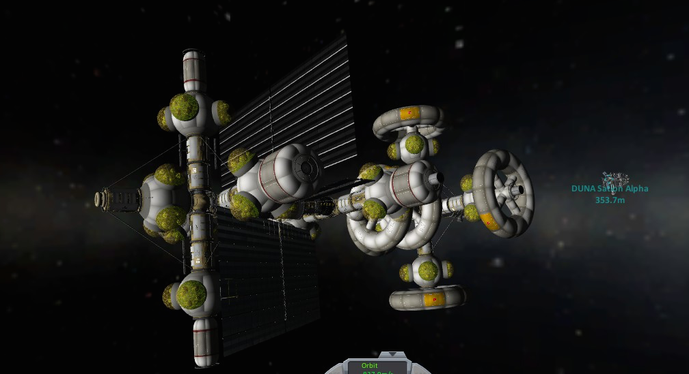
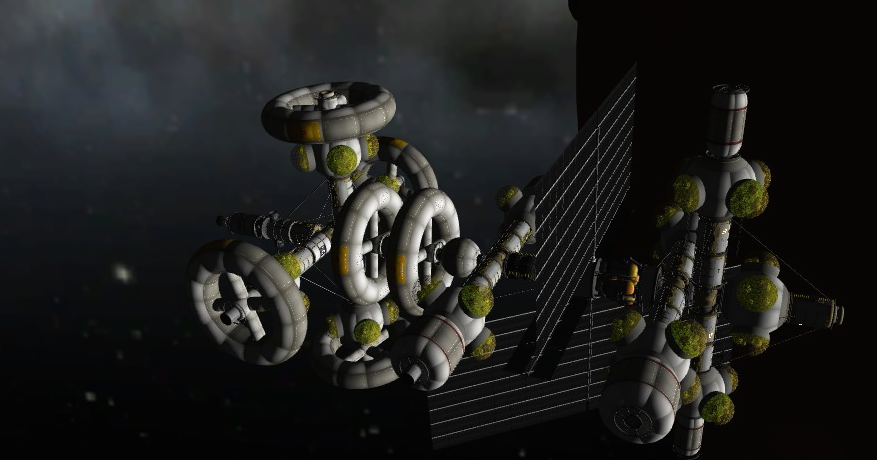

ksp-InterImm
================

Kerbal Space Program 模拟火星基地等等。

## Kerbal Space Program

这是一个沙盒游戏，可以模拟天空、太空活动，也有很多科学元素，尤其是使用来 MOD 之后，例如 SCANsat 的科学卫星， Tarsier Space Technology 的太空望远镜等。

### 星际移民局的旗子

### GameData

`Squad/Flags/InterImmBanner.png` 是星际移民局的旗子的路径。

### 存档

`saves` 目录中是火星基地草稿的存档

1. InterImmV1 是第一版
2. InterImmV2 是第二版

## 火星基地 ALPHA 版（V1）

可以[在这里](http://www.guokr.com/post/648925/)看到说明和图片。

### 用到的 MOD

我的 KSP 版本是 0.25。

用到的插件包括：

* [SCANsat](https://github.com/S-C-A-N/SCANsat) 制作地图。
* [Kerbal Attachment System](http://www.curse.com/ksp-mods/kerbal/223900-kerbal-attachment-system-kas) 用来连接基地或者挂载、拖拽重物。
* [MechJeb](http://www.curse.com/ksp-mods/kerbal/220221-mechjeb) 非常有用的，可以实现很多自动飞行。
* [HyperEdit](http://www.kerbaltekaerospace.com/?page=hyperedit) 用来把物体瞬移到一个位置，因为实际上来说，往 Duna 发射这种大型的设施简直费事费力，所以我用 HyperEdit 来作弊。

## 火星基地 V2

### 简要说明

除了原来的基地，又添加了新基地，同样由轨道空间站和地面基地组成。

轨道空间站是使用 MKS 搭建出来的。在地面搭建好之后直接使用 HyperEdit 释放到 Duna 轨道上。

这次地面基地选址是经过细心挑选的，地面足够平整。地面基地由五部分组成：三个大型生活区，一个科研基地（包括一部地面车辆），一个零件储藏及连接基地。大型生活区使用 MKS 搭建，仅包括生活所必须的部件，并不包含生产部件。可容纳大量的地面生活人员。

生活区和科研基地是都是可扩展的，零件储藏和连接基地可以用来 dock 所有五个部分，同时也储藏了大量的 KAS 等部件。

### 用到的 MOD

我的 KSP 版本是 0.90。

除了在第一版中用到的插件：

* [SCANsat](https://github.com/S-C-A-N/SCANsat) 制作地图。
* [Kerbal Attachment System](http://www.curse.com/ksp-mods/kerbal/223900-kerbal-attachment-system-kas) 用来连接基地或者挂载、拖拽重物。
* [MechJeb](http://www.curse.com/ksp-mods/kerbal/220221-mechjeb) 非常有用的，可以实现很多自动飞行。
* [HyperEdit](http://www.kerbaltekaerospace.com/?page=hyperedit) 用来把物体瞬移到一个位置，因为实际上来说，往 Duna 发射这种大型的设施简直费事费力，所以我用 HyperEdit 来作弊。

还有如下新添加的插件：

* [Modular Kolonization System](http://www.curse.com/ksp-mods/kerbal/220668-modular-kolonization-system) 一个有很多傻瓜模块和充气模块的插件，可以用来建造轨道空间站或者地面基地。
* TarsierSpaceTech 非必须
* KSP-AVC 非必须

